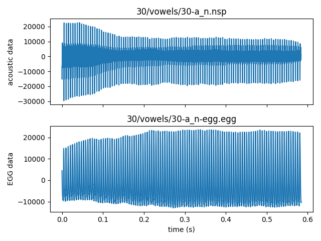

`sbvoicedb`: Saarbrueken Voice Database Reader module
======================================================

|pypi| |status| |pyver| |license|

.. |pypi| image:: https://img.shields.io/pypi/v/sbvoicedb
  :alt: PyPI
.. |status| image:: https://img.shields.io/pypi/status/sbvoicedb
  :alt: PyPI - Status
.. |pyver| image:: https://img.shields.io/pypi/pyversions/sbvoicedb
  :alt: PyPI - Python Version
.. |license| image:: https://img.shields.io/github/license/tikuma-lsuhsc/python-sbvoicedb
  :alt: GitHub

This Python module provides capability to download and organize Saarbrücker Stimmdatenbank 
(Saarbrücken Voice Database, https://stimmdb.coli.uni-saarland.de/) with SQLAlchemy (sqlalchemy.org).

Features
--------

* Auto-download the database file at https://stimmdb.coli.uni-saarland.de
* Auto-download the associated datasets from Zonedo: https://zenodo.org/records/16874898
* Supports incremental, on-demand download per-pathology
* Stores database information as a local SQLite3 file
* Database and datasets are accessed via SQLAlchemy ORM (Object Relational Mapper)
  classes for ease of use
* Acoustic and EGG signals can be retrieved as NumPy arrays directly
* Supports filters to specify study conditions on pathologies, speaker's gender and age, 
  recording types, etc.
* Fixes known errors in the dataset (i.e., corrupted files and swapping of acoustic/EGG data)

Install
-------

.. code-block:: bash

  pip install sbvoicedb

If you prefer manually downloading the full dataset from Zonedo (`data.zip`, the 
full dataset, 17.9 GB) you may download the file first and unzip the content 
to a directory. Make sure that the zip file's internal structure is preserved.
If you're placing your downloaded database in ``my_svd`` folder, its directory
structure should appear like this:

.. code-block::

  .../my_svd/
  └── data/
      ├── 1/
      │   ├── sentnces
      │   │   ├── 1-phrase.nsp
      │   │   └── 1-phrase-egg.egg
      │   └── vowels
      │       ├── 1-a_h.nsp
      │       ├── 1-a_h.nsp
      │       ⋮
      │       └── 1-u_n-egg.egg
      ├── 2/
      │   │   ├── 2-phrase.nsp
      │   │   └── 2-phrase-egg.egg
      │   └── vowels
      │       ├── 2-a_h.nsp
      │       ├── 2-a_h.nsp
      │       ⋮
      │       └── 2-u_n-egg.egg
      ⋮

The default ``my_svd`` location is OS dependent:

======= ===========================================
Windows ``~\AppData\Local\sbvoicedb\sbvoicedb``
Linux   ``~/.local/share/sbvoicedb``
macOS   ``~/Library/Application Support/sbvoicedb``
======= ===========================================

Tutorial/Examples
-----------------

.. code-block:: python

  from sbvoicedb import SbVoiceDb

  # to open the database in the default location
  db = SbVoiceDb()

  # OR to open the database at a specific data location
  dbpath = '<path to the root directory of the extracted database>'
  db = SbVoiceDb(dbpath)

This creates a new database instance. If ``dbpath`` does not contain the SQLite
database file, ``sbvoice.db``, it gets populated from the dataset's summary CSV 
file.

.. note::

  The ``sbvoice.db`` database file can be viewed using any SQLite database viewer
  such as DB Browser for SQLite (https://sqlitebrowser.org/)

If any portion of the dataset is already available in ``data`` subdirectory, it 
further populates the recordings table. These database population processes are
visualized with progress bars in the console.

By default, no dataset will be downloaded at this point. You can check how much
of the datasets are available by

.. code-block:: python

  print(f"{db.number_of_sessions_downloaded}/{db.number_of_all_sessions}")

The ``db.number_of_all_sessions`` property should always return 2043.

Your study may only use a subset of the database. In such case, you can set filters
on each table when creating the database object. For example, the following creates
a subset of the database which only consists of recordings of sustained /a/ or /i/
at normal pitch, uttered by women of age between 50 and 70 with normal voice or 
with a diagnosis of Laryngitis or Dysphonie:

.. code-block:: python

  from sbvoicedb import Pathology, Speaker, RecordingSession, Recording

  db_laryngitis = SbVoiceDb(
      dbdir,
      pathology_filter=Pathology.name.in_(["Laryngitis", "Dysphonie"]),
      include_healthy=True,
      speaker_filter=Speaker.gender == "w",
      session_filter=RecordingSession.speaker_age.between(50, 70),
      recording_filter=Recording.utterance.in_(("a_n", "i_n")),
  )

.. note::

  ``Pathology``, ``Speaker``, ``RecordingSession``, and ``Recording`` are 
  the objects of SQLAlchemy's Object Relational Mapper (ORM) class 
  (https://docs.sqlalchemy.org/en/20/orm/), and users are referred to 
  SQLAlchemy's documentation to set up the filter arguments. For
  convenience, ``sqlalchemy.sql.expression`` is mapped to ``sbvoicedb.sql_expr``
  in case advanced where expressions are needed. See 
  https://docs.sqlalchemy.org/en/20/core/expression_api.html

The overview of the database can be found in the three SQLite views:
``recording_session_summary``, ``recording_summary``, and ``pathology_summary``.
These summary tables can be queried (possibly with additional constraints) and 
could easily be turned into a Pandas' ``DataFrame``. To list the recording 
sessions, use ``SbVoiceDb.recording_session_summary()``:

.. code-block:: python

  import pandas as pd

  print(pd.DataFrame(db_laryngitis.recording_session_summary()))

prints

.. code-block::

      speaker_id gender  age  session_id type  nb_recordings
  0          142      w   54         495    p             14
  1          732      w   63        1057    p             14
  2         1358      w   58         449    p             14
  3         1360      w   56         451    p             14
  4         1379      w   59         568    p             14
  ...        ...    ...  ...         ...  ...            ...
  38        2539      w   68        2405    p             14
  39        2582      w   58        2537    p             14
  40        2650      w   54        2516    p             14
  41        2678      w   50        2544    p             14
  42        2728      w   60        2602    p             14
  [43 rows x 7 columns]

To list the recordings, use ``SbVoiceDb.recording_summary()``:

.. code-block:: python

  print(pd.DataFrame(db_laryngitis.recording_summary()))

prints

.. code-block::

         id  speaker_id gender  age  session_id type utterance  duration
  0    2602         142      w   54         495    p       a_n   1.89166
  1    2599         142      w   54         495    p       i_n   1.42548
  2    7553         732      w   63        1057    p       a_n   0.75482
  3    7552         732      w   63        1057    p       i_n   1.40040
  4    2505        1358      w   58         449    p       a_n   1.46502
  ..    ...         ...    ...  ...         ...  ...       ...       ...
  81  27241        2650      w   54        2516    p       i_n   1.49020
  82  27629        2678      w   50        2544    p       a_n   0.59864
  83  27630        2678      w   50        2544    p       i_n   0.65198
  84  28383        2728      w   60        2602    p       a_n   1.06466
  85  28382        2728      w   60        2602    p       i_n   1.42588

  [86 rows x 8 columns]

Finally, to list pathologies, use ``SbVoiceDb.pathology_summary()``:

.. code-block:: python

  print(pd.DataFrame(db_laryngitis.pathology_summary()))

prints

.. code-block::

     id        name  nb_speakers  nb_sessions
  0  25   Dysphonie           99          101
  1   5  Laryngitis          128          140

In the SQLite database, the actual tables holding data are: ``pathologies``, 
``speakers``, ``recording_sessions``, and ``recordings``. The contents of these 
tables can be accessed by 

.. code-block:: python

  db.get_pathology_count()
  db.get_speaker_count()
  db.get_session_count()
  db.get_recording_count()

  db.iter_pathologies()
  db.iter_speakers()
  db.iter_sessions()
  db.iter_recordings()

.. code-block:: python

  print(f"number of pathologies found: {db_laryngitis.get_pathology_count()}")
  print(f"number of recording sessions found: {db_laryngitis.get_session_count()}")
  print(f"number of unique speakers: {db_laryngitis.get_speaker_count()}")
  print(f"number of recordings: {db_laryngitis.get_recording_count()}")

.. code-block::

  number of pathologies found: 2
  number of recording sessions found: 43
  number of unique speakers: 42
  number of recordings: 86

To navigate through the actual database, you can iterate over the rows of any of 
the tables:

.. code-block:: python

  # iterate over included pathologies
  for patho in db_laryngitis.iter_pathologies():
    print(f'{patho.id)}: {patho.name} ({patho.downloaded})'

  # iterate over included speakers
  for speaker in db_laryngitis.iter_speakers():
    print(f'{speaker.id)}: {speaker.gender}'

  # iterate over included recording sessions
  for session in db_laryngitis.iter_sessions():
    print(f'{session.id)}: speaker_id={session.speaker_id}, speaker_age={session.speaker_age}, speaker_health={session.type}'

  # iterate over included recordings
  for rec in db_laryngitis.iter_recordings():
    print(f'{rec.id)}: session_id={rec.session_id}, utterance={rec.utterance}, nspfile={rec.nspfile}, eggfile={rec.eggfile}'

To retrieve the acoustic and egg data, use ``Recording.nspdata`` and ``Recording.eggdata``:

.. code-block:: python

  from os import path
  import numpy as np
  from matplotlib import pyplot as plt

  rec = next(db_laryngitis.iter_recordings())

  t = np.arange(rec.length)/rec.rate

  fig, axes = plt.subplots(2, 1, sharex=True)
  axes[0].plot(t, rec.nspdata)
  axes[0].set_ylabel("acoustic data")
  axes[0].set_title(path.relpath(rec.nspfile, db_laryngitis.datadir))
  axes[1].plot(t, rec.eggdata)
  axes[1].set_ylabel("EGG data")
  axes[1].set_title(path.relpath(rec.eggfile, db_laryngitis.datadir))
  axes[1].set_xlabel("time (s)")
  plt.tight_layout()
  plt.show()

Data Corrections
------------------

SVD Dataset has a several recordings that are incorrectly stored. ``sbvoicedb``
corrects the following data files during file retrieval. (Downloaded files are
not renamed.)

* 139-xxx, 141-xxx - acoustic & egg swapped
* 713-i_n/713-iau - corrupted NSP/EGG files
* 980-iau/980-iau-egg - acoustic and EGG waveforms were flipflopped at n = 583414
* 980-phrase/980-phrase-egg - acoustic & Egg files were named backwards
* 1697-iau/1697-iau-egg - acoustic & Egg files were named backwards
* 1697-phrase/1697-phrase-egg - acoustic & Egg files were named backwards

Uncorrected entries
^^^^^^^^^^^^^^^^^^^

* 1573-a_n, 1573-i_n, 1573-u_n not cut correctly. It is possible to obtain 
  correct intervals from 1573-iau.

License
-------

* ``sbvoicedb`` is released under the GNU General Public License, version 2. See 
  `the LICENSE file <./LICENSE>`__ for details.

* `Saarbruecken Voice Database <https://zenodo.org/records/16874898>`__ released 
  under `CC BY 4.0 (Creative Commons Attribution 4.0 International) <https://creativecommons.org/licenses/by/4.0>`__. 
  ``sbvoicedb`` programmatically downloads the recordings directly from https://zenodo.org,
  except for the metadata CSV file (``summary.csv``) in `data.zip <https://zenodo.org/records/16874898/files/data.zip>`__.
  This file is included in the ``sbvoicedb`` package at ``sbvoicedb/summary.csv``.
